# IEC61850 Connector - Getting Started

This guide demonstrates the setup and configuration of the Industrial Edge Connector for IEC 61850 using an IEC 61850 simulator (`61850-sim`) or a physical Intelligent Electronic Device (IED).

## Table of Contents
- [Overview](#overview)
- [Prerequisites](#prerequisites)
- [Used Components](#used-components)
- [IEC 61850 Server (IED/Simulator) Preparation](#iec-61850-server-simulator-preparation)
- [App Installation](#app-installation)
- [Connector for IEC 61850 Configuration](#connector-for-iec-61850-configuration)
- [Data Management](#data-management)
- [Extra: Visualization with Energy Manager](#extra-energy-manager---visualization)

## Description

The IEC61850 Connector enables data acquisition from IEC 61850 compliant Intelligent Electronic Devices (IEDs) or simulators. It facilitates communication between substation automation networks and the Industrial Edge platform, adhering to the IEC 61850 standard for communication networks and systems in substations.

### Overview

  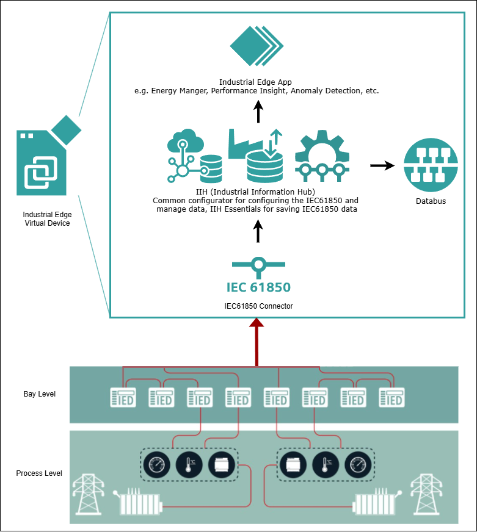
   
  <em>Architecture using Siemens Industrial Edge</em>

  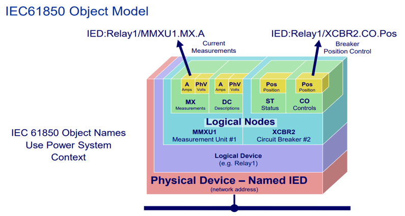
   
  <em>IEC61850 Object Model</em>

## Requirements

#### Prerequisites

- Industrial Edge Management virtual (IEMv)
- Industrial Edge Device (IED) (e.g., IEVD v1.22)
- Industrial Edge IEC61850 Connector
- An IEC 61850 compliant Intelligent Electronic Device (IED) or a simulator (e.g., `61850-sim`)
- An SCL (System Configuration Language) file (.cid, .icd, .iid, .ssd) describing the IEC 61850 server's data model.
- Network connection between the Industrial Edge Device and the IEC 61850 IED/simulator.
- Web browser (Google Chrome preferred)

### Used Components

#### Industrial Edge Components

   | Component | Version |
   |-----------|---------|
   | Industrial Edge Management virtual | v2.4.2-3 (Example Version) |
   | Industrial Edge Device | IEVD v1.22 (regular IED can be used) |

#### Industrial Edge Apps

   | App | Version |
   |-----------|---------|
   | Connector for IEC 61850 | v1.0.0 |
   | Common Configurator | v2.0.1 |
   | IE Databus | v3.2.1 |
   | IIH Essentials | v2.1.1 |
   | IIH Semantics | v2.1.0 (Optional) |
   | Energy Manager | v1.21.0 (Optional) |

#### IEC 61850 Simulator

- **61850-sim Simulator**
    - A Python-based open-source IEC 61850 simulator available at [GitHub](https://github.com/st-ing/61850-sim).
    - Provides a basic IEC 61850 server for testing and development.
    - Runs on a standard PC/server and can be configured to expose various logical nodes and data objects.

## IEC 61850 Server (Simulator) Preparation

Guide to setup the simulator can be found in GitHub in [/st-ing/61850-sim](https://github.com/st-ing/61850-sim) 

## App Installation

### Install Connector for IEC 61850
Follow the regular [Industrial Edge app installation process](https://docs.industrial-operations-x.siemens.cloud/r/en-us/v1.0/connector-for-iec-61850/installation/installation-process).

1.  Go to the IEM catalog.
2.  Search for "IEC61850 Connector" and click on "Install".
3.  Proceed through the installation wizard. Unlike some other connectors, the IEC 61850 Connector typically doesn't require specific initial configuration files during installation.
4.  Click on "Next" and then install the app.

## Connector for IEC 61850 Configuration

The connector configuration will be done via Common Configurator in the IED. Log in to your IED and open the Common Configurator app.

  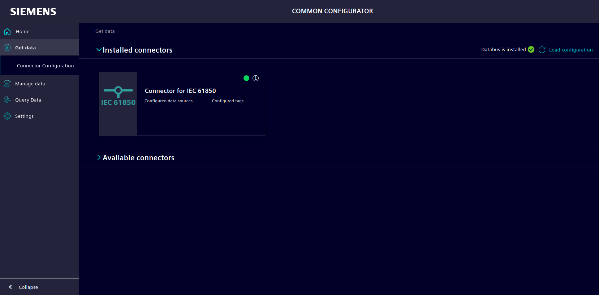
   
  

#### 1. Add IEC 61850 Server Connection

1.  In the Common Configurator, click on `Add` and choose `IEC 61850` as Communication protocol.
2.  Fill in the connection details for your IEC 61850 IED or simulator:
    *   **Name:** A descriptive name for your connection (e.g., "Substation_IED_1", "61850_Simulator").
    *   **IP Address:** The IP address of your IEC 61850 IED or the machine running the `61850-sim` simulator.
    *   **Port:** The MMS port (default is 102).
3.  Click on "Save" or "Apply" to establish the connection. The connector will attempt to connect to the specified IEC 61850 server.

  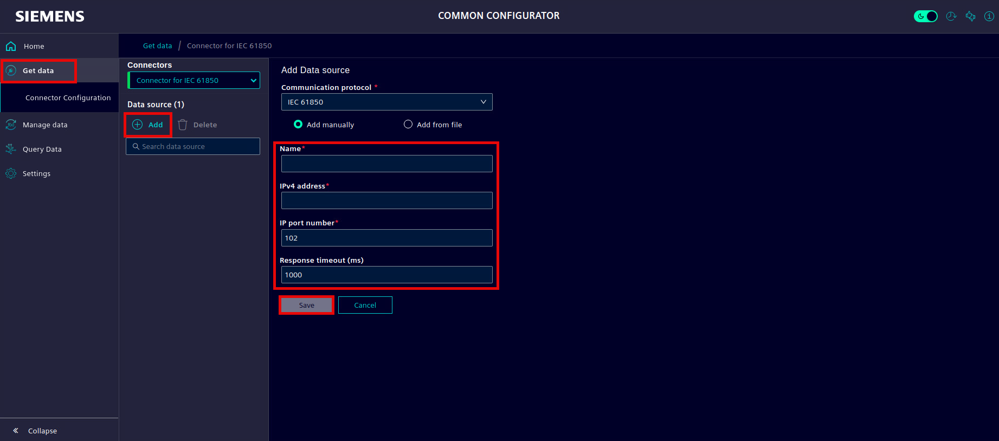
   

#### 2. Browse and Select Tags (Data Points)

Once the IEC 61850 server connection is established:

1.  Navigate to the `Tags` tab for your newly added Data Source.

  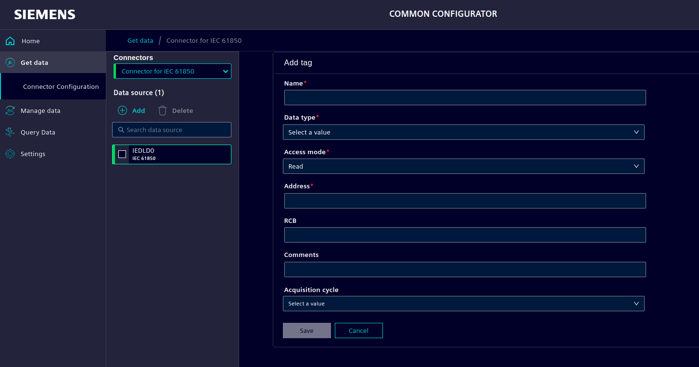
   

2.  Click on `Add` to add your IEC61850 data. Fill, at least, the mandatory fields.
    * When adding the tags address, use the following structure: 
    "**IED/LogicalDevice$LogicalNode$Measurement$...** "
    e.g, "IEDLD0/MHAI1$MX$Hz$instMag$f" as you can see when using [IEC Browser](https://support.industry.siemens.com/cs/ww/en/view/109744534) to see the simulator.

  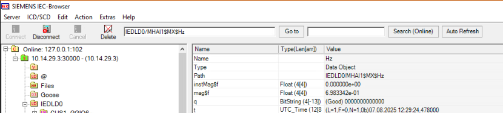
   

5.  Click on `Add to Data Source` to include the selected tags in your configuration.
6.  Finally, `Deploy` the configuration to apply the changes to the Connector.

  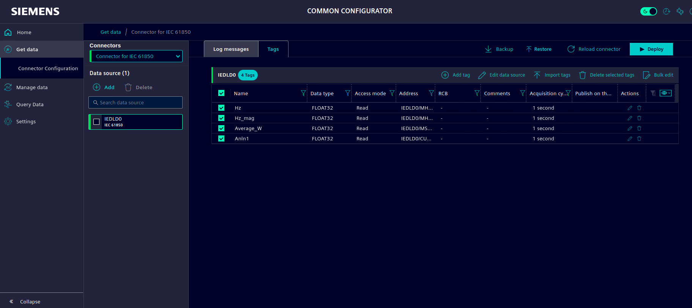
   
  <em>Added Tags</em>

## Data Management

Through Common Configurator, acquired data can be organized and managed. In this case, an Asset will be created, containing all the tags received using the Connector for IEC 61850.

Follow the steps:
1.  In the `Manage Data` tab, create your asset.

  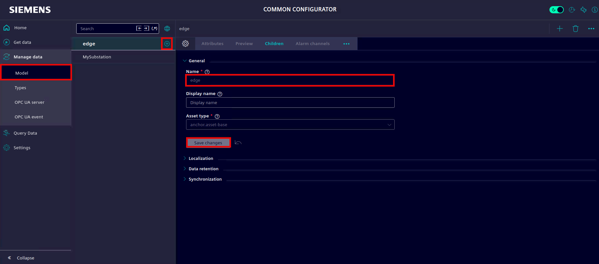
   
  <em></em>

2.  Choose the connection and create attributes from the tags in the list below. Map the IEC 61850 data points to meaningful attributes within your asset structure.

  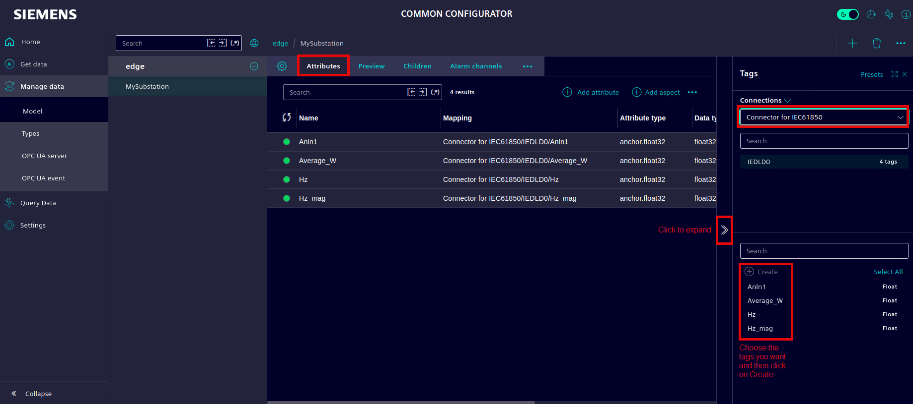
   
  <em></em>

    If needed, created attributes can be edited after creation. Click on the pencil icon to edit them.

3.  Check the values of the attributes.

In the `Preview` tab, attributes can be visualized. Attributes can be added to the chart by using the `+` buttons. Also, aggregations can be used to visualize the values with defined aggregations (in the next image, in the chart, click on "None" and aggregations will appear).

  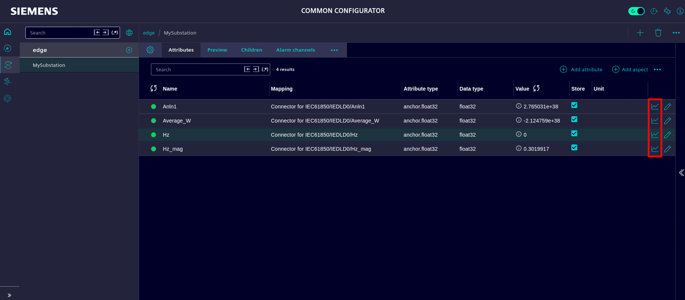
   
  <em>  </em>

  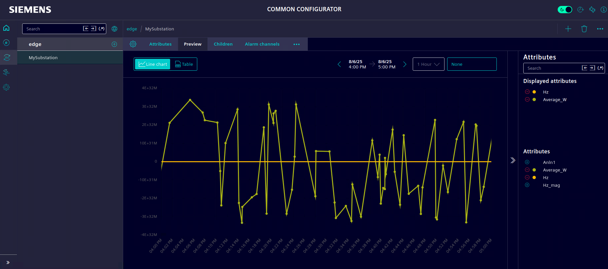
   
  <em></em>

# Extra: Energy Manager - Visualization

The Energy Manager App for Industrial Edge is a specialized application designed to collect, process, and visualize energy-related data within the Siemens Industrial Edge ecosystem.

The [Energy Manager How To](https://github.com/industrial-edge/energy-manager-getting-started) can be followed to create dashboards to visualize the values from the IED.
